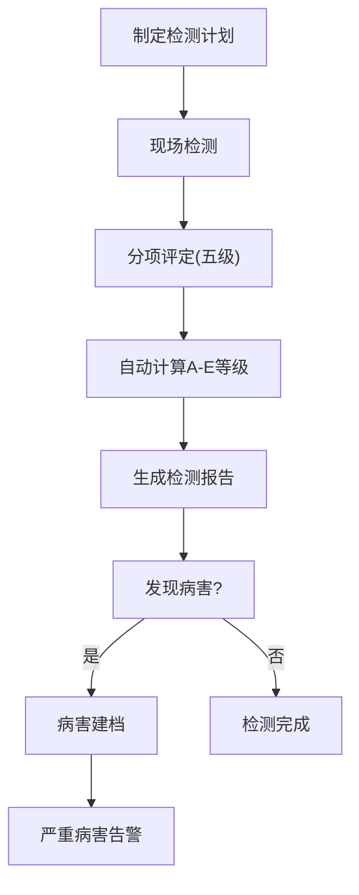
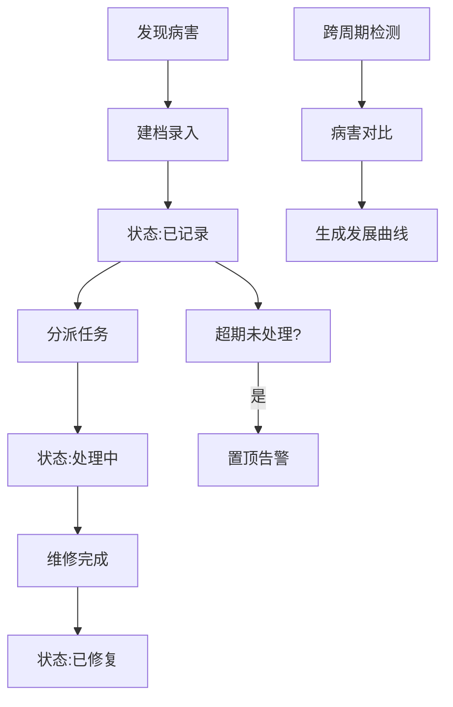

## 1. 产品概述
城市桥梁健康监测与定期检测记录系统，面向城市桥梁管理养护部门，实现桥梁全生命周期的数字化管理。通过档案管理、定期检测、病害追踪、维修加固、养护巡查等核心模块，结合Leaflet地图可视化与数据看板，为桥梁安全运维提供决策支持。

- **目标用户**：城市市政管理部门、桥梁养护单位、检测机构
- **核心价值**：实现桥梁管理数字化、检测流程标准化、病害发展可追踪、养护决策数据化

## 2. 核心 Features

### 2.1 用户角色
| 角色 | 注册方式 | 核心权限 |
|------|----------|----------|
| 系统管理员 | 内部账号 | 全功能权限、用户管理、系统配置 |
| 养护管理人员 | 内部账号 | 桥梁档案管理、检测记录查看、维修计划制定 |
| 检测人员 | 内部账号 | 检测数据录入、病害记录上传、现场巡查记录 |
| 领导查看 | 内部账号 | 数据看板查看、统计报表导出、告警信息查看 |

### 2.2 Feature Module
1. **数据看板**：桥梁等级分布、检测完成率、超期告警、费用趋势、年龄分布
2. **桥梁档案管理**：基础信息录入、列表查询、地图展示
3. **定期检测管理**：检测计划、分项评定、综合等级自动生成
4. **病害追踪管理**：病害建档、跨周期对比、发展曲线、状态流转、超期告警
5. **维修加固记录**：施工记录、费用统计、复核提醒、全寿命成本分析
6. **养护巡查记录**：日常异常记录、突发事件记录、自动生成特殊检测任务
7. **地图可视化**：Leaflet地图、多维度筛选、技术状况五色标记、E级闪烁告警

### 2.3 页面详情
| 页面名称 | 模块名称 | Feature描述 |
|----------|----------|-------------|
| 数据看板 | 总览统计卡片 | 桥梁总数、各等级数量、本月检测数、超期告警数 |
| 数据看板 | 技术状况分布图 | 饼图展示A-E级桥梁数量分布 |
| 数据看板 | D/E级重点关注列表 | 表格展示D/E级桥梁，支持快速跳转详情 |
| 数据看板 | 检测计划完成率 | 进度条展示各类型检测完成率 |
| 数据看板 | 超期未检测清单 | 列表展示超期未检测桥梁及超期天数 |
| 数据看板 | 严重病害超期告警 | 置顶展示超期未处理严重病害，红色高亮 |
| 数据看板 | 桥梁年龄分布直方图 | 柱状图展示不同年代桥梁数量分布 |
| 数据看板 | 年度维修费用趋势 | 折线图展示历年维修费用变化趋势 |
| 桥梁档案 | 档案列表 | 分页列表、多条件筛选、快速搜索 |
| 桥梁档案 | 档案详情 | 展示桥梁全部信息，包含位置、照片、历史记录 |
| 桥梁档案 | 档案表单 | 新增/编辑桥梁基本信息，含地图选点 |
| 定期检测 | 检测列表 | 按桥梁、类型、时间筛选检测记录 |
| 定期检测 | 检测评定表 | 桥面铺装、伸缩缝、支座等分项五级评定 |
| 定期检测 | 综合等级计算 | 根据分项得分自动计算A-E综合技术状况等级 |
| 病害追踪 | 病害列表 | 按桥梁、类型、严重程度、处理状态筛选 |
| 病害追踪 | 病害详情 | 病害基本信息、历史对比、发展曲线图 |
| 病害追踪 | 状态流转 | 已记录→处理中→已修复，超期自动告警 |
| 维修加固 | 维修列表 | 按桥梁、类型、时间筛选维修记录 |
| 维修加固 | 维修详情 | 施工信息、费用、前后对比照片、复核日期 |
| 维修加固 | 费用统计 | 按桥梁、年度、类型汇总维修费用与频次 |
| 养护巡查 | 巡查记录 | 日常异常情况记录列表 |
| 养护巡查 | 突发事件 | 车辆撞击、洪水冲刷等事件记录与应急措施 |
| 地图可视化 | 主地图 | Leaflet地图展示所有桥梁位置 |
| 地图可视化 | 筛选面板 | 按类型、年代、技术状况等级筛选 |
| 地图可视化 | 标记样式 | 按类型/年代分色，技术状况绿黄橙红黑五色，E级闪烁 |

## 3. 核心流程

### 3.1 定期检测流程
1. 养护人员制定检测计划，指派检测人员
2. 检测人员现场检测，对桥面铺装、伸缩缝、支座、上下部结构、栏杆、排水设施逐项评定（1-5级，完好至危险）
3. 系统根据分项评定结果自动计算综合技术状况等级（A-E级）
4. 检测中发现的病害独立建档记录
5. 严重病害自动触发告警，通知相关人员处理

### 3.2 病害追踪流程
1. 检测/巡查中发现病害，录入类型、位置、尺寸、严重程度、照片
2. 系统自动标记处理状态为"已记录"
3. 管理人员分派处理任务，状态更新为"处理中"
4. 维修完成后更新为"已修复"，记录维修信息
5. 下次检测时对同一病害进行对比，生成发展曲线图
6. 严重病害超期未处理自动置顶告警

## 4. 用户界面设计

### 4.1 设计风格
- **主色调**：深海蓝 (#1e3a5f) - 代表专业、可靠
- **辅助色**：科技青 (#0ea5e9) - 用于交互元素、高亮
- **状态色**：绿 (#10b981) A级、黄 (#f59e0b) B级、橙 (#f97316) C级、红 (#ef4444) D级、黑 (#1f2937) E级
- **按钮风格**：圆角4px，轻微阴影，hover时上浮+阴影加深
- **字体**：标题使用"Noto Serif SC"，正文使用"Noto Sans SC"
- **布局风格**：顶部导航栏+左侧侧边栏+主内容区，卡片式内容承载
- **图标风格**：使用lucide-react线性图标，统一风格

### 4.2 页面设计概述
| 页面名称 | 模块名称 | UI元素 |
|----------|----------|--------|
| 数据看板 | 总览卡片 | 渐变背景卡片，数据大字展示，迷你趋势图 |
| 数据看板 | 图表区域 | Chart.js图表，统一配色，交互tooltip |
| 数据看板 | 告警列表 | 红色背景闪烁动画，紧急标签 |
| 桥梁档案 | 列表页 | 数据表格，固定表头，斑马纹，hover高亮 |
| 桥梁档案 | 表单页 | 分组fieldset，清晰标签，表单验证提示 |
| 定期检测 | 评定表 | 表格布局，单选按钮组，实时分数计算 |
| 定期检测 | 等级展示 | 彩色徽章，状态文字说明 |
| 病害追踪 | 详情页 | 照片轮播，发展曲线图，状态时间线 |
| 地图可视化 | 主地图 | 全屏地图，悬浮信息窗，图例说明 |
| 地图可视化 | 筛选面板 | 折叠式面板，多选标签，应用/重置按钮 |

### 4.3 响应性
- **桌面端优先**：1920px及以上最优显示，最小支持1280px
- **平板适配**：侧边栏可折叠，表格横向滚动
- **触控优化**：按钮最小尺寸44x44px，列表项增大点击区域
- **地图交互**：支持触摸缩放、拖动，信息窗适配移动端布局

### 4.4 特殊交互效果
- **E级桥梁标记**：红色脉冲动画，持续闪烁，鼠标悬停放大
- **超期告警项**：红色边框闪烁，数字角标跳动
- **页面加载**：骨架屏加载，内容淡入动画
- **状态流转**：时间线动画，状态切换过渡效果
- **地图标记**：点击弹跳动画，筛选切换时渐隐渐显
