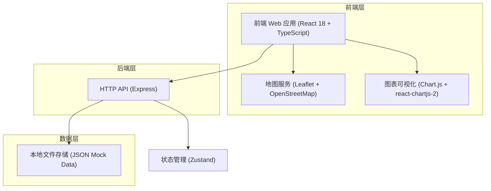
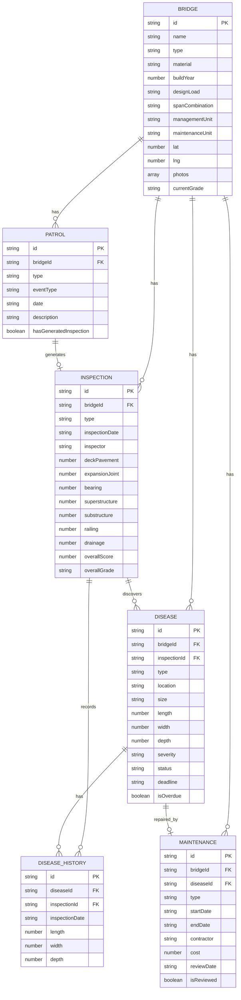

## 1. 架构设计



## 2. 技术描述

- **前端**：React 18 + TypeScript + Vite + TailwindCSS 3
- **状态管理**：Zustand
- **路由**：React Router DOM
- **地图**：Leaflet 1.9 + react-leaflet
- **图表**：Chart.js + react-chartjs-2
- **图标**：lucide-react
- **后端**：Express 4 + TypeScript + CORS
- **数据存储**：本地JSON文件（Mock数据），便于演示
- **初始化工具**：vite-init (react-express-ts模板)

## 3. 路由定义

| 路由路径 | 页面名称 | 用途 |
|----------|----------|------|
| /dashboard | 数据看板 | 总览统计、图表、告警信息 |
| /bridges | 桥梁档案列表 | 桥梁列表查询、筛选、搜索 |
| /bridges/new | 新增桥梁档案 | 录入新桥梁基本信息 |
| /bridges/:id | 桥梁档案详情 | 展示单座桥梁全部信息 |
| /bridges/:id/edit | 编辑桥梁档案 | 修改桥梁基本信息 |
| /inspections | 定期检测列表 | 检测记录列表与筛选 |
| /inspections/new | 新增检测记录 | 录入检测评定数据 |
| /inspections/:id | 检测记录详情 | 查看检测报告与评定结果 |
| /diseases | 病害列表 | 病害档案列表与筛选 |
| /diseases/:id | 病害详情 | 病害信息、历史对比、发展曲线 |
| /maintenances | 维修加固列表 | 维修记录列表与费用统计 |
| /maintenances/new | 新增维修记录 | 录入维修施工信息 |
| /patrols | 养护巡查列表 | 巡查记录与突发事件管理 |
| /patrols/new | 新增巡查记录 | 录入日常巡查信息 |
| /map | 地图可视化 | 桥梁地图展示与多维度筛选 |

## 4. API 定义

### 4.1 类型定义

```typescript
// 桥梁基本信息
interface Bridge {
  id: string;
  name: string;
  type: '梁桥' | '拱桥' | '刚架桥' | '悬索桥' | '斜拉桥';
  material: '钢筋混凝土' | '预应力混凝土' | '钢' | '钢混组合' | '圬工';
  buildYear: number;
  designLoad: string;
  spanCombination: string;
  managementUnit: string;
  maintenanceUnit: string;
  lat: number;
  lng: number;
  photos: string[];
  currentGrade: 'A' | 'B' | 'C' | 'D' | 'E';
  createdAt: string;
  updatedAt: string;
}

// 定期检测记录
interface Inspection {
  id: string;
  bridgeId: string;
  type: '常规定期' | '结构定期' | '特殊检测';
  inspectionDate: string;
  inspector: string;
  weather: string;
  // 分项评定 1-5级 (1完好, 2良好, 3较差, 4差, 5危险)
  deckPavement: number;      // 桥面铺装
  expansionJoint: number;    // 伸缩缝
  bearing: number;           // 支座
  superstructure: number;    // 上部结构
  substructure: number;      // 下部结构
  railing: number;           // 栏杆
  drainage: number;          // 排水设施
  // 自动计算
  overallScore: number;
  overallGrade: 'A' | 'B' | 'C' | 'D' | 'E';
  remarks: string;
  photos: string[];
}

// 病害记录
interface Disease {
  id: string;
  bridgeId: string;
  inspectionId?: string;
  type: '裂缝' | '剥落' | '钢筋锈蚀' | '变形' | '渗漏' | '其他';
  location: string;
  size: string;
  length?: number;
  width?: number;
  depth?: number;
  severity: '轻微' | '一般' | '较严重' | '严重' | '危险';
  status: '已记录' | '处理中' | '已修复';
  description: string;
  photos: string[];
  recordedDate: string;
  assignedDate?: string;
  repairedDate?: string;
  deadline: string;
  isOverdue: boolean;
  historyRecords: DiseaseHistory[];
}

// 病害历史记录（用于跨周期对比）
interface DiseaseHistory {
  id: string;
  inspectionId: string;
  inspectionDate: string;
  length?: number;
  width?: number;
  depth?: number;
  description: string;
  photos: string[];
}

// 维修加固记录
interface Maintenance {
  id: string;
  bridgeId: string;
  diseaseId?: string;
  type: '日常养护' | '小修' | '中修' | '大修' | '加固' | '重建';
  startDate: string;
  endDate: string;
  contractor: string;
  cost: number;
  description: string;
  beforePhotos: string[];
  afterPhotos: string[];
  reviewDate: string;
  reviewResult?: string;
  isReviewed: boolean;
}

// 养护巡查记录
interface Patrol {
  id: string;
  bridgeId: string;
  type: '日常巡查' | '突发事件';
  eventType?: '车辆撞击' | '洪水冲刷' | '超重车通行' | '地震' | '其他';
  date: string;
  recorder: string;
  description: string;
  emergencyMeasures?: string;
  photos: string[];
  hasGeneratedInspection: boolean;
  generatedInspectionId?: string;
}

// 统计数据
interface DashboardStats {
  totalBridges: number;
  gradeDistribution: Record<string, number>;
  overdueInspections: { bridge: Bridge; daysOverdue: number }[];
  overdueDiseases: { disease: Disease; bridge: Bridge; daysOverdue: number }[];
  ageDistribution: { range: string; count: number }[];
  annualCostTrend: { year: number; cost: number }[];
  inspectionCompletionRate: { type: string; completed: number; total: number }[];
  highRiskBridges: Bridge[];
}
```

### 4.2 API 接口

| 方法 | 路径 | 描述 | 请求参数 | 返回类型 |
|------|------|------|----------|----------|
| GET | /api/bridges | 获取桥梁列表 | type, material, grade, keyword | Bridge[] |
| GET | /api/bridges/:id | 获取桥梁详情 | id | Bridge |
| POST | /api/bridges | 新增桥梁 | Bridge | Bridge |
| PUT | /api/bridges/:id | 更新桥梁 | Bridge | Bridge |
| DELETE | /api/bridges/:id | 删除桥梁 | id | boolean |
| GET | /api/inspections | 获取检测列表 | bridgeId, type, year | Inspection[] |
| GET | /api/inspections/:id | 获取检测详情 | id | Inspection |
| POST | /api/inspections | 新增检测记录 | Inspection | Inspection |
| GET | /api/diseases | 获取病害列表 | bridgeId, severity, status, isOverdue | Disease[] |
| GET | /api/diseases/:id | 获取病害详情 | id | Disease |
| POST | /api/diseases | 新增病害 | Disease | Disease |
| PUT | /api/diseases/:id/status | 更新病害状态 | status, date | Disease |
| GET | /api/maintenances | 获取维修列表 | bridgeId, type, year | Maintenance[] |
| POST | /api/maintenances | 新增维修记录 | Maintenance | Maintenance |
| GET | /api/maintenances/stats | 获取维修费用统计 | bridgeId, year | cost summary |
| GET | /api/patrols | 获取巡查列表 | bridgeId, type | Patrol[] |
| POST | /api/patrols | 新增巡查记录 | Patrol | Patrol |
| POST | /api/patrols/:id/generate-inspection | 生成特殊检测 | id | Inspection |
| GET | /api/dashboard/stats | 获取看板统计 | year | DashboardStats |

## 5. 数据模型

### 5.1 ER图



### 5.2 Mock数据结构

数据存储于 `/api/data/` 目录下，包含：
- `bridges.json` - 桥梁数据（30条示例）
- `inspections.json` - 检测记录（60条示例）
- `diseases.json` - 病害记录（80条示例）
- `maintenances.json` - 维修记录（40条示例）
- `patrols.json` - 巡查记录（50条示例）

## 6. 核心组件结构

```
src/
├── components/
│   ├── layout/
│   │   ├── AppLayout.tsx        # 主布局（顶栏+侧栏+内容区）
│   │   ├── Sidebar.tsx          # 侧边导航
│   │   └── Header.tsx           # 顶部导航
│   ├── common/
│   │   ├── StatusBadge.tsx      # 状态徽章组件
│   │   ├── GradeBadge.tsx       # 技术状况等级徽章
│   │   ├── DataTable.tsx        # 通用数据表格
│   │   ├── ConfirmModal.tsx     # 确认对话框
│   │   └── AlertBanner.tsx      # 告警横幅
│   ├── dashboard/
│   │   ├── StatCard.tsx         # 统计卡片
│   │   ├── GradeDistributionChart.tsx  # 等级分布饼图
│   │   ├── AgeDistributionChart.tsx    # 年龄分布直方图
│   │   ├── CostTrendChart.tsx          # 费用趋势折线图
│   │   ├── ProgressBar.tsx             # 进度条
│   │   └── AlertList.tsx               # 告警列表
│   ├── bridge/
│   │   ├── BridgeForm.tsx       # 桥梁表单
│   │   ├── BridgeCard.tsx       # 桥梁卡片
│   │   └── BridgeInfo.tsx       # 桥梁详情信息
│   ├── inspection/
│   │   ├── RatingTable.tsx      # 分项评定表
│   │   └── GradeResult.tsx      # 综合等级结果
│   ├── disease/
│   │   ├── DiseaseTimeline.tsx  # 病害状态时间线
│   │   └── GrowthChart.tsx      # 病害发展曲线图
│   ├── maintenance/
│   │   ├── PhotoCompare.tsx     # 前后照片对比
│   │   └── CostSummary.tsx      # 费用汇总
│   └── map/
│       ├── BridgeMap.tsx        # Leaflet地图主组件
│       ├── MarkerPopup.tsx      # 标记信息窗
│       └── MapFilter.tsx        # 地图筛选面板
├── stores/
│   ├── useBridgeStore.ts
│   ├── useInspectionStore.ts
│   ├── useDiseaseStore.ts
│   ├── useMaintenanceStore.ts
│   ├── usePatrolStore.ts
│   └── useDashboardStore.ts
├── utils/
│   ├── gradeCalculator.ts       # 综合等级计算
│   ├── dateUtils.ts
│   ├── colorUtils.ts
│   └── mockDataGenerator.ts
├── types/
│   └── index.ts                 # 类型定义
├── pages/
│   ├── Dashboard.tsx
│   ├── BridgeList.tsx
│   ├── BridgeDetail.tsx
│   ├── BridgeForm.tsx
│   ├── InspectionList.tsx
│   ├── InspectionForm.tsx
│   ├── DiseaseList.tsx
│   ├── DiseaseDetail.tsx
│   ├── MaintenanceList.tsx
│   ├── MaintenanceForm.tsx
│   ├── PatrolList.tsx
│   ├── PatrolForm.tsx
│   └── MapView.tsx
└── App.tsx
```
